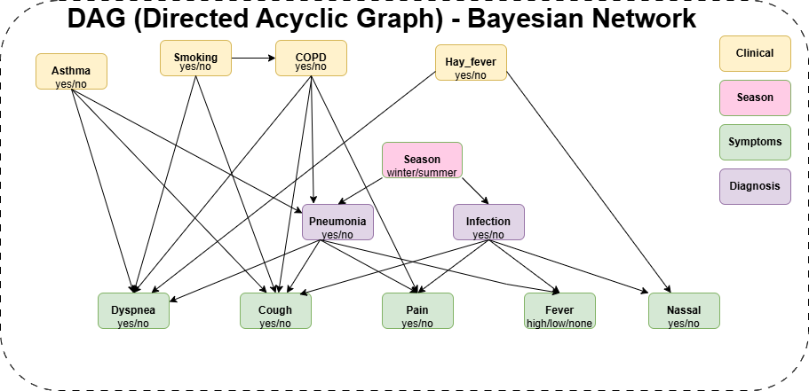
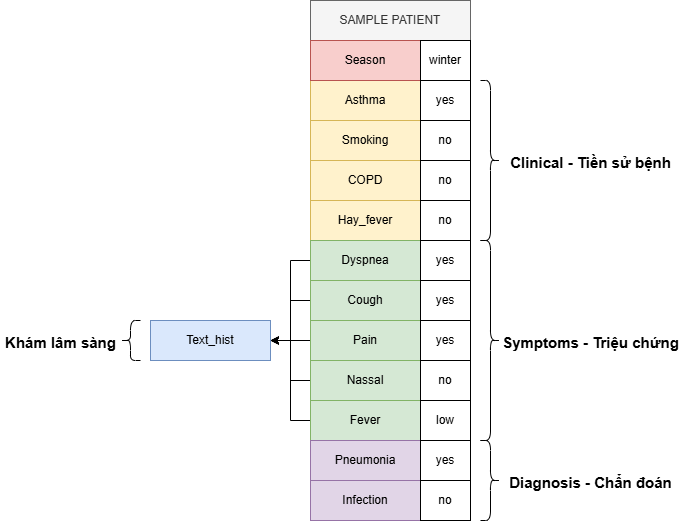
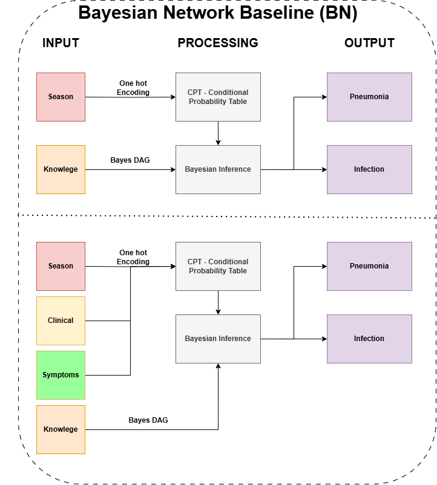
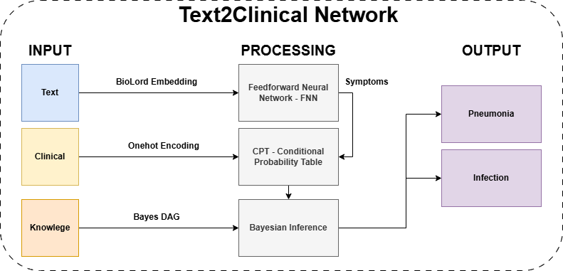

# 🧠 Suy Diễn Chẩn Đoán Viêm Phổi Dựa Trên Mạng Bayesian

## 📌 Introduce

Công trình nghiên cứu khoa học này tập trung vào việc phát triển hệ thống suy diễn chẩn đoán viêm phổi dựa trên **Mạng Bayesian** (Bayesian Network) và FNN. Hệ thống kết hợp các thông tin lâm sàng, mô tả triệu chứng và tri thức y học để suy luận xác suất bệnh viêm phổi với độ tin cậy cao, hỗ trợ bác sĩ trong công tác chẩn đoán và ra quyết định.

Công trình sử dụng dữ liệu bệnh án bao gồm:
- Triệu chứng (dưới dạng văn bản)
- Các chỉ số sinh học
- Chẩn đoán của bác sĩ (nhãn)
- Embedding văn bản bằng mô hình BioLord2023
- Phân tích các mối quan hệ nguyên nhân – kết quả giữa triệu chứng và chẩn đoán

## 🧑‍💻 Thành viên thực hiện

| Họ và tên          | Vai trò trong đề tài                                 |
|--------------------|------------------------------------------------------|
| Trần Vĩnh Huy      | Chủ nhiệm đề tài                                     |
| Nguyễn Minh Nhựt   | Thành viên                                           |
| Trần Gia Bảo       | Thành viên                                           |
| Trương Quang Long  | Thành viên                                           |

## 🧩 Mô hình và phương pháp

Nhóm sử dụng 3 mô hình chính để kết hợp và so sánh:

1. **Bayesian Network (BN):**  
   Mô hình đồ thị có hướng thể hiện mối quan hệ xác suất giữa các đặc trưng triệu chứng và chẩn đoán viêm phổi.

2. **BioLord-FFNN:**  
   - Sử dụng embedding BioLord2023 cho văn bản mô tả triệu chứng.  
   - Kết hợp với mô hình **FFNN** để dự đoán nhãn viêm phổi.  
   - Đầu ra xác suất được sử dụng làm node đầu vào cho mạng Bayesian.

3. **Hybrid Bayesian Neural Model:**  
   - Kết hợp mạng nơ-ron để trích xuất đặc trưng phi tuyến mạnh mẽ từ dữ liệu đa dạng.  
   - Đầu ra được đưa vào mạng Bayesian để suy diễn với tính diễn giải cao hơn.

## 🖼️ Hình ảnh mô hình

### 1. Kiến trúc hệ thống tổng thể

|  |  |
|----------------------------------------|------------------------------------------|

### 2. Mạng Bayesian mẫu minh họa

### 3. Kết hợp embedding với suy diễn

## 📈 Kết quả sơ bộ

| Mô hình                    | Accuracy | Precision | Recall | AUC    |
|----------------------------|----------|-----------|--------|--------|
| Bayesian Network           | 0.83     | 0.80      | 0.85   | 0.88   |
| BioLord + FFNN             | 0.86     | 0.84      | 0.87   | 0.91   |
| Hybrid Bayesian + Neural   | 0.89     | 0.87      | 0.90   | 0.94   |

## 📚 Công nghệ sử dụng

- BioLord2023 Embedding

## 📝 Ghi chú

- Dữ liệu sử dụng là dữ liệu tổng hợp mô phỏng cho mục đích nghiên cứu.
- Đề tài hướng đến khả năng diễn giải rõ ràng, phù hợp ứng dụng trong môi trường y tế thực tế.

---

## 📫 Liên hệ

Mọi thắc mắc xin liên hệ: **xxx**

